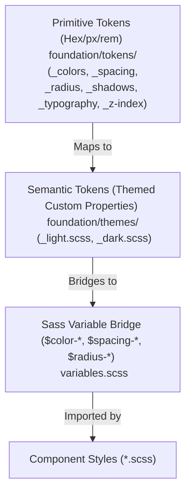

# Style System Architecture: Airbnb Design Tokens & Sass Variable Bridge

This directory contains the core styling architecture for the frontend client application. The project follows a **decoupled, 3-tiered design token system** built on native CSS Custom Properties, bridged with Sass variables for backward compatibility, static linting support, and strict alignment with [`docs/DESIGN.md`](../../../docs/DESIGN.md).

---

## Architecture Overview



---

## The 3-Tiered Token System

### 1. Primitive Tokens (`foundation/tokens/`)

Primitives are raw, contextless values declared under `:root`. They define the absolute bounds of our design system based on `docs/DESIGN.md`:

- **`_colors.scss`**:
    - Brand & Accent: Airbnb Rausch (`--primi-rausch: #ff385c`), pressed (`#e00b41`), disabled (`#ffd1da`), error (`#c13515`), Luxe (`#460479`), Plus (`#92174d`).
    - Surfaces: Canvas (`--primi-canvas: #ffffff`), soft surface (`--primi-surface-soft: #f7f7f7`), card (`--primi-surface-card: #ffffff`), strong surface (`--primi-surface-strong: #f2f2f2`).
    - Hairlines: Default border (`--primi-hairline: #dddddd`), soft hairline (`--primi-hairline-soft: #ebebeb`), strong border (`--primi-border-strong: #c1c1c1`).
    - Text & Ratings: Ink (`--primi-ink: #222222`), body (`--primi-body: #3f3f3f`), muted (`--primi-muted: #6a6a6a`), muted-soft (`--primi-muted-soft: #929292`), star rating (`#222222`), legal link (`#428bff`).
- **`_spacing.scss`**: 4px-based scale with 2px micro-step: `xxs` (2px), `xs` (4px), `sm` (8px), `md` (12px), `base` (16px), `lg` (24px), `xl` (32px), `xxl` (48px), `section` (64px).
- **`_radius.scss`**: Soft shape language: `none` (0px), `xs` (4px), `sm` (8px — buttons & inputs), `md` (14px — property/reservation cards), `lg` (20px), `xl` (32px — category strips), `full` (9999px — pill search bar & search orb).
- **`_shadows.scss`**: Single-tier elevation system (`--primi-shadow-card: 0 0 0 1px rgb(0 0 0 / 2%), 0 2px 6px 0 rgb(0 0 0 / 4%), 0 4px 8px 0 rgb(0 0 0 / 10%)`).
- **`_typography.scss`**: Font family stack (`Airbnb Cereal VF`, `Circular`, system stack, `Inter`) and scale (`tag: 8px`, `badge: 11px`, `micro: 12px`, `caption-sm: 13px`, `sm: 14px`, `md: 16px`, `display-sm: 20px`, `display-md: 21px`, `display-lg: 22px`, `display-xl: 28px`, `rating: 64px`).
- **`_z-index.scss`**: Semantic layering (`--primi-z-below: -1` up to `--primi-z-tooltip: 600`).

---

### 2. Semantic Tokens & Themes (`foundation/themes/`)

Semantic tokens map primitives to context-specific roles and UI intents:

- **`_light.scss`**: Default light theme mapping under `:root` and `[data-theme='light']`:
    - `--color-primary`: Rausch (`#ff385c`)
    - `--color-canvas`: Pure white (`#ffffff`)
    - `--color-ink`: Near-black (`#222222`)
    - `--color-surface-soft`: Off-white / light neutral (`#f7f7f7`)
    - `--color-hairline`: 1px border dividers (`#dddddd`)
- **`_dark.scss`**: Dark mode theme mapping under `[data-theme='dark']` and `@media (prefers-color-scheme: dark)`:
    - Preserves Rausch (`#ff385c`) brand voltage while mapping surfaces to charcoal canvas (`#141414`) and card floors (`#1e1e1e`).

---

### 3. Sass Variable Bridge (`variables.scss`)

Entry point for component styles. Exposes:

- Brand colors: `$color-primary`, `$color-rausch`, `$color-ink`, `$color-canvas`, `$color-surface-soft`, `$color-surface-card`, `$color-hairline`, etc.
- Spacing: `$spacing-xxs` through `$spacing-section`.
- Border Radius: `$radius-sm` (8px), `$radius-md` (14px), `$radius-full` (9999px).
- Shadows: `$shadow-card`, `$shadow-card-hover`, `$shadow-dropdown`, `$shadow-modal`.
- Responsive Breakpoints:
    - `@include variables.mobile`: `< 744px`
    - `@include variables.tablet`: `744px – 1128px`
    - `@include variables.desktop`: `> 1128px`

---

## How to Use in Components

Always use modern `@use` rules:

```scss
@use '@/styles/variables' as variables;

.property-card {
    background-color: variables.$color-surface-card;
    border: 1px solid variables.$color-hairline;
    border-radius: variables.$radius-md; // 14px soft radius
    padding: variables.$spacing-base; // 16px internal gutter
    box-shadow: variables.$shadow-card;
    @include variables.transition-ease;

    &:hover {
        transform: translateY(-2px);
        box-shadow: variables.$shadow-card-hover;
    }

    .title {
        color: variables.$color-ink;
        font-size: variables.$font-size-md; // 16px
    }

    .price-tag {
        color: variables.$color-primary; // Rausch #ff385c
    }

    @include variables.mobile {
        padding: variables.$spacing-sm;
    }
}
```

### Color Mixing Rule

Use native CSS `color-mix()` instead of legacy Sass color functions:

```scss
// Native CSS color mixing:
background-color: color-mix(in srgb, variables.$color-primary 90%, white);
```
