# GlobeTrotter Database Architecture: ER Diagram & PlantUML Specifications

This document outlines the complete relational data model for the **GlobeTrotter** travel platform, covering the core travel itinerary builder, destination discovery catalog, financial budgeting ledger, social collaboration, AI chat/RAG subsystem, and authentication.

---

## 1. Mermaid Entity-Relationship (ER) Diagram

```mermaid
erDiagram
    %% =========================================================================
    %% DOMAIN 1: AUTHENTICATION & IDENTITY
    %% =========================================================================
    users {
        uuid id PK "gen_random_uuid()"
        text first_name "NOT NULL"
        text last_name "NOT NULL"
        text email UK "NOT NULL"
        text password "NOT NULL (Bcrypt Hash)"
        text profile_image "Default Avatar URL"
        role_enum role "user | admin"
        boolean email_verified "Default FALSE"
        boolean is_active "Default TRUE"
        boolean is_deleted "Default FALSE (Soft Delete)"
        timestamptz deleted_at "Nullable"
        timestamptz recovery_expires_at "Nullable"
        timestamptz created_at "NOW()"
        timestamptz updated_at "NOW()"
    }

    password_reset_tokens {
        uuid id PK "gen_random_uuid()"
        uuid user_id FK "REFERENCES users(id) ON DELETE CASCADE"
        text token_hash UK "NOT NULL (SHA256)"
        timestamptz expires_at "NOT NULL"
        timestamptz used_at "Nullable"
        timestamptz created_at "NOW()"
    }

    %% =========================================================================
    %% DOMAIN 2: DESTINATION & ACTIVITY CATALOG (MASTER DATA)
    %% =========================================================================
    cities {
        uuid id PK "gen_random_uuid()"
        text name "NOT NULL (e.g. Paris)"
        text country "NOT NULL (e.g. France)"
        text region "e.g. Europe"
        numeric cost_index "10,2 scale"
        numeric popularity "10,2 scale"
        timestamptz created_at "NOW()"
        timestamptz updated_at "NOW()"
    }

    activities {
        uuid id PK "gen_random_uuid()"
        uuid city_id FK "REFERENCES cities(id) ON DELETE RESTRICT"
        text name "NOT NULL"
        text description "Nullable"
        text activity_type "e.g. Sightseeing, Adventure"
        numeric cost "12,2 scale"
        integer duration_minutes "Duration in mins"
        text currency "Default INR"
        timestamptz created_at "NOW()"
        timestamptz updated_at "NOW()"
    }

    activity_images {
        uuid id PK "gen_random_uuid()"
        uuid activity_id FK "REFERENCES activities(id) ON DELETE CASCADE"
        text image_url "NOT NULL"
        integer display_order "Order sequence (>= 0)"
        timestamptz created_at "NOW()"
    }

    %% =========================================================================
    %% DOMAIN 3: TRAVEL PLANNING & MULTI-CITY ITINERARIES
    %% =========================================================================
    trips {
        uuid id PK "gen_random_uuid()"
        uuid owner_id FK "REFERENCES users(id) ON DELETE CASCADE"
        text name "NOT NULL"
        text description "Nullable"
        date start_date "NOT NULL (YYYY-MM-DD)"
        date end_date "NOT NULL (YYYY-MM-DD)"
        text cover_photo_url "Nullable"
        numeric budget_amount "12,2 scale (>= 0)"
        text budget_currency "Default INR"
        trip_status_enum status "draft | planned | ongoing | completed | cancelled"
        trip_visibility_enum visibility "private | public"
        text public_slug UK "Unique shareable slug"
        timestamptz created_at "NOW()"
        timestamptz updated_at "NOW()"
    }

    trip_stops {
        uuid id PK "gen_random_uuid()"
        uuid trip_id FK "REFERENCES trips(id) ON DELETE CASCADE"
        uuid city_id FK "REFERENCES cities(id) ON DELETE RESTRICT"
        date start_date "NOT NULL"
        date end_date "NOT NULL"
        integer sequence_order "Stop order (1, 2, 3...)"
        timestamptz created_at "NOW()"
        timestamptz updated_at "NOW()"
    }

    trip_stop_activities {
        uuid id PK "gen_random_uuid()"
        uuid trip_stop_id FK "REFERENCES trip_stops(id) ON DELETE CASCADE"
        uuid activity_id FK "REFERENCES activities(id) ON DELETE RESTRICT"
        date activity_date "NOT NULL"
        time start_time "Optional HH:MM"
        time end_time "Optional HH:MM"
        integer sequence_order "Daily order"
        text notes "User notes"
        timestamptz created_at "NOW()"
        timestamptz updated_at "NOW()"
    }

    %% =========================================================================
    %% DOMAIN 4: FINANCIAL EXPENSE & BUDGET LEDGER
    %% =========================================================================
    trip_cost_items {
        uuid id PK "gen_random_uuid()"
        uuid trip_id FK "REFERENCES trips(id) ON DELETE CASCADE"
        uuid trip_stop_id FK "REFERENCES trip_stops(id) ON DELETE SET NULL"
        uuid trip_stop_activity_id FK "REFERENCES trip_stop_activities(id) ON DELETE SET NULL"
        cost_category_enum category "transport | stay | activity | meal"
        text description "Expense details"
        numeric amount "12,2 scale (>= 0)"
        text currency "Default INR"
        date cost_date "Nullable date of cost"
        timestamptz created_at "NOW()"
        timestamptz updated_at "NOW()"
    }

    %% =========================================================================
    %% DOMAIN 5: SOCIAL, SHARING & WISHLISTS
    %% =========================================================================
    saved_destinations {
        uuid user_id PK, FK "REFERENCES users(id) ON DELETE CASCADE"
        uuid city_id PK, FK "REFERENCES cities(id) ON DELETE CASCADE"
        timestamptz created_at "NOW()"
    }

    trip_shares {
        uuid id PK "gen_random_uuid()"
        uuid trip_id FK "REFERENCES trips(id) ON DELETE CASCADE"
        uuid shared_with_user_id FK "REFERENCES users(id) ON DELETE CASCADE"
        uuid created_by FK "REFERENCES users(id) ON DELETE CASCADE"
        timestamptz created_at "NOW()"
    }

    %% =========================================================================
    %% DOMAIN 6: AI CONVERSATION & RAG KNOWLEDGE BASE
    %% =========================================================================
    chats {
        uuid id PK "gen_random_uuid()"
        uuid user_id FK "REFERENCES users(id) ON DELETE CASCADE"
        text guest_id "Nullable guest identifier"
        text title "Chat thread title"
        timestamptz created_at "NOW()"
        timestamptz updated_at "NOW()"
    }

    messages {
        uuid id PK "gen_random_uuid()"
        uuid chat_id FK "REFERENCES chats(id) ON DELETE CASCADE"
        text content "Message text"
        text role "user | ai"
        timestamptz created_at "NOW()"
        timestamptz updated_at "NOW()"
    }

    files {
        uuid id PK "gen_random_uuid()"
        text file_id UK "Unique imagekit/storage key"
        text name "Original filename"
        integer size "Size in bytes"
        text file_path "Storage path"
        text url "Public access URL"
        text file_type "File mime/category"
        text mimetype "Full mimetype"
        text thumbnail_url "Thumbnail URL"
        integer width "Image width"
        integer height "Image height"
        jsonb ai_tags "Vision tags"
        uuid message_id FK "REFERENCES messages(id) ON DELETE CASCADE"
        uuid uploaded_by FK "REFERENCES users(id) ON DELETE SET NULL"
        text processing_status "pending | completed | failed"
        text rag_status "pending | completed | failed"
        jsonb metadata "Structured analysis"
        timestamptz created_at "NOW()"
        timestamptz updated_at "NOW()"
    }

    rag_files {
        uuid id PK "gen_random_uuid()"
        text file_id UK "Unique document key"
        text name "Document name"
        integer size "Size in bytes"
        text file_path "Path"
        text url "URL"
        text file_type "Type"
        text mimetype "Mimetype"
        uuid uploaded_by FK "REFERENCES users(id) ON DELETE SET NULL"
        text processing_status "pending | completed | failed"
        text rag_status "pending | completed | failed"
        jsonb metadata "Document metadata"
        timestamptz created_at "NOW()"
        timestamptz updated_at "NOW()"
    }

    chunks {
        uuid id PK "gen_random_uuid()"
        uuid file_id FK "REFERENCES files(id) ON DELETE CASCADE"
        uuid chat_id FK "REFERENCES chats(id) ON DELETE CASCADE"
        uuid rag_file_id FK "REFERENCES rag_files(id) ON DELETE CASCADE"
        integer chunk_index "Index position"
        text text "Raw extracted text chunk"
        text markdown "Markdown parsed representation"
        text source "Source file/URL"
        jsonb metadata "Chunk coordinates/headers"
        text document_type "Document categorization"
        timestamptz created_at "NOW()"
        timestamptz updated_at "NOW()"
    }

    %% =========================================================================
    %% DOMAIN 7: PAYMENTS & BILLING (LEGACY COMPATIBILITY)
    %% =========================================================================
    payments {
        uuid id PK "gen_random_uuid()"
        text order_id "Razorpay order ID"
        text payment_id "Razorpay payment ID"
        text signature "Verification signature"
        integer amount "Amount in smallest unit / integer"
        text currency "Currency code (INR, USD)"
        text status "pending | completed | failed"
        timestamptz created_at "NOW()"
        timestamptz updated_at "NOW()"
    }

    %% =========================================================================
    %% RELATIONSHIPS & CARDINALITY
    %% =========================================================================
    users ||--o{ password_reset_tokens : "has"
    users ||--o{ trips : "owns"
    users ||--o{ saved_destinations : "bookmarks"
    users ||--o{ trip_shares : "collaborates"
    users ||--o{ chats : "creates"
    users ||--o{ files : "uploads"
    users ||--o{ rag_files : "manages"

    cities ||--o{ activities : "offers"
    cities ||--o{ trip_stops : "visited in"
    cities ||--o{ saved_destinations : "saved in"

    activities ||--o{ activity_images : "contains"
    activities ||--o{ trip_stop_activities : "scheduled as"

    trips ||--|{ trip_stops : "consists of"
    trips ||--o{ trip_cost_items : "tracks budget via"
    trips ||--o{ trip_shares : "shared via"

    trip_stops ||--o{ trip_stop_activities : "schedules"
    trip_stops ||--o{ trip_cost_items : "attaches stay/transport"

    trip_stop_activities ||--o{ trip_cost_items : "attaches activity cost"

    chats ||--|{ messages : "contains"
    chats ||--o{ chunks : "context scoped to"

    messages ||--o{ files : "attaches"

    files ||--o{ chunks : "chunked into"
    rag_files ||--|{ chunks : "chunked into"
```



---

## 2. PlantUML ER / Domain Class Diagram

```plantuml
@startuml GlobeTrotter_ER_Diagram
!theme vibrant
skinparam linetype ortho
skinparam packageStyle rectangle
skinparam classAttributeIconSize 0
skinparam defaultFontName "Segoe UI"
skinparam roundCorner 8

title <size:20><b>GlobeTrotter Database Architecture</b></size>\n<size:12>PostgreSQL Database Schema & Domain Entity Relational Model</size>

' =====================================================================
' ENUMS
' =====================================================================
package "Enumerations" #F4F6F7 {
    enum role_enum {
        user
        admin
    }

    enum trip_visibility_enum {
        private
        public
    }

    enum trip_status_enum {
        draft
        planned
        ongoing
        completed
        cancelled
    }

    enum cost_category_enum {
        transport
        stay
        activity
        meal
    }

    enum rag_processing_status_enum {
        pending
        completed
        failed
    }

    enum rag_source_type_enum {
        admin_global
        user_upload
    }
}

' =====================================================================
' DOMAIN 1: AUTHENTICATION & USERS
' =====================================================================
package "1. Identity & Profile Domain" #E8F8F5 {
    entity "**users**" as users {
        + **id**: uuid <<PK>>
        --
        * first_name: text
        * last_name: text
        * email: text <<UK>>
        * password: text
        profile_image: text
        * role: role_enum = 'user'
        * email_verified: boolean = false
        * is_active: boolean = true
        * is_deleted: boolean = false
        deleted_at: timestamptz
        recovery_expires_at: timestamptz
        * created_at: timestamptz
        * updated_at: timestamptz
    }

    entity "**password_reset_tokens**" as password_reset_tokens {
        + **id**: uuid <<PK>>
        --
        * user_id: uuid <<FK>>
        * token_hash: text <<UK>>
        * expires_at: timestamptz
        used_at: timestamptz
        * created_at: timestamptz
    }
}

' =====================================================================
' DOMAIN 2: CATALOG (CITIES & ACTIVITIES)
' =====================================================================
package "2. Destination & Activity Catalog" #EAF2F8 {
    entity "**cities**" as cities {
        + **id**: uuid <<PK>>
        --
        * name: text
        * country: text
        region: text
        cost_index: numeric(10,2)
        popularity: numeric(10,2)
        * created_at: timestamptz
        * updated_at: timestamptz
        --
        <<Unique>> (country, name)
    }

    entity "**activities**" as activities {
        + **id**: uuid <<PK>>
        --
        * city_id: uuid <<FK>>
        * name: text
        description: text
        activity_type: text
        cost: numeric(12,2)
        duration_minutes: integer
        currency: text = 'INR'
        * created_at: timestamptz
        * updated_at: timestamptz
    }

    entity "**activity_images**" as activity_images {
        + **id**: uuid <<PK>>
        --
        * activity_id: uuid <<FK>>
        * image_url: text
        * display_order: integer = 0
        * created_at: timestamptz
    }
}

' =====================================================================
' DOMAIN 3: TRAVEL PLANNING & ITINERARIES
' =====================================================================
package "3. Travel Itinerary Engine" #FEF9E7 {
    entity "**trips**" as trips {
        + **id**: uuid <<PK>>
        --
        * owner_id: uuid <<FK>>
        * name: text
        description: text
        * start_date: date
        * end_date: date
        cover_photo_url: text
        budget_amount: numeric(12,2)
        * budget_currency: text = 'INR'
        * status: trip_status_enum = 'draft'
        * visibility: trip_visibility_enum = 'private'
        public_slug: text <<UK>>
        * created_at: timestamptz
        * updated_at: timestamptz
    }

    entity "**trip_stops**" as trip_stops {
        + **id**: uuid <<PK>>
        --
        * trip_id: uuid <<FK>>
        * city_id: uuid <<FK>>
        * start_date: date
        * end_date: date
        * sequence_order: integer
        * created_at: timestamptz
        * updated_at: timestamptz
        --
        <<Unique>> (trip_id, sequence_order)
    }

    entity "**trip_stop_activities**" as trip_stop_activities {
        + **id**: uuid <<PK>>
        --
        * trip_stop_id: uuid <<FK>>
        * activity_id: uuid <<FK>>
        * activity_date: date
        start_time: time
        end_time: time
        * sequence_order: integer = 1
        notes: text
        * created_at: timestamptz
        * updated_at: timestamptz
        --
        <<Unique>> (trip_stop_id, activity_id, activity_date, start_time)
    }
}

' =====================================================================
' DOMAIN 4: FINANCIAL EXPENSE LEDGER
' =====================================================================
package "4. Budget & Financial Ledger" #FDEDEC {
    entity "**trip_cost_items**" as trip_cost_items {
        + **id**: uuid <<PK>>
        --
        * trip_id: uuid <<FK>>
        trip_stop_id: uuid <<FK>>
        trip_stop_activity_id: uuid <<FK>>
        * category: cost_category_enum
        description: text
        * amount: numeric(12,2)
        * currency: text = 'INR'
        cost_date: date
        * created_at: timestamptz
        * updated_at: timestamptz
    }
}

' =====================================================================
' DOMAIN 5: SOCIAL, WISHLISTS & SHARING
' =====================================================================
package "5. Wishlists & Social Collaboration" #F5EEF8 {
    entity "**saved_destinations**" as saved_destinations {
        + **user_id**: uuid <<PK, FK>>
        + **city_id**: uuid <<PK, FK>>
        --
        * created_at: timestamptz
    }

    entity "**trip_shares**" as trip_shares {
        + **id**: uuid <<PK>>
        --
        * trip_id: uuid <<FK>>
        * shared_with_user_id: uuid <<FK>>
        * created_by: uuid <<FK>>
        * created_at: timestamptz
        --
        <<Unique>> (trip_id, shared_with_user_id)
    }
}

' =====================================================================
' DOMAIN 6: AI CHAT & RAG ENGINE
' =====================================================================
package "6. AI Assistant & RAG Intelligence" #EBF5FB {
    entity "**chats**" as chats {
        + **id**: uuid <<PK>>
        --
        * user_id: uuid <<FK>>
        guest_id: text
        * title: text = 'New chat'
        * created_at: timestamptz
        * updated_at: timestamptz
    }

    entity "**messages**" as messages {
        + **id**: uuid <<PK>>
        --
        * chat_id: uuid <<FK>>
        * content: text
        * role: text
        * created_at: timestamptz
        * updated_at: timestamptz
    }

    entity "**files**" as files {
        + **id**: uuid <<PK>>
        --
        * file_id: text <<UK>>
        * name: text
        * size: integer
        * file_path: text
        * url: text
        * file_type: text
        * mimetype: text
        thumbnail_url: text
        width: integer
        height: integer
        ai_tags: jsonb
        * message_id: uuid <<FK>>
        uploaded_by: uuid <<FK>>
        * processing_status: text = 'pending'
        * rag_status: text = 'pending'
        metadata: jsonb
        * created_at: timestamptz
        * updated_at: timestamptz
    }

    entity "**rag_files**" as rag_files {
        + **id**: uuid <<PK>>
        --
        * file_id: text <<UK>>
        * name: text
        * size: integer
        * file_path: text
        * url: text
        * file_type: text
        * mimetype: text
        uploaded_by: uuid <<FK>>
        * processing_status: text = 'pending'
        * rag_status: text = 'pending'
        metadata: jsonb
        * created_at: timestamptz
        * updated_at: timestamptz
    }

    entity "**chunks**" as chunks {
        + **id**: uuid <<PK>>
        --
        file_id: uuid <<FK>>
        chat_id: uuid <<FK>>
        * rag_file_id: uuid <<FK>>
        * chunk_index: integer
        * text: text
        * markdown: text
        source: text
        metadata: jsonb
        document_type: text
        * created_at: timestamptz
        * updated_at: timestamptz
    }
}

' =====================================================================
' DOMAIN 7: PAYMENTS & BILLING
' =====================================================================
package "7. Payments & Billing (Legacy)" #F2F4F4 {
    entity "**payments**" as payments {
        + **id**: uuid <<PK>>
        --
        * order_id: text
        payment_id: text
        signature: text
        * amount: integer
        * currency: text
        * status: text = 'pending'
        * created_at: timestamptz
        * updated_at: timestamptz
    }
}

' =====================================================================
' RELATIONSHIPS & CARDINALITIES
' =====================================================================
users ||--o{ password_reset_tokens : "1:N (user_id)"
users ||--o{ trips : "1:N (owner_id)"
users ||--o{ saved_destinations : "1:N (user_id)"
users ||--o{ trip_shares : "1:N (shared_with)"
users ||--o{ trip_shares : "1:N (created_by)"
users ||--o{ chats : "1:N (user_id)"
users ||--o{ files : "0..1:N (uploaded_by)"
users ||--o{ rag_files : "0..1:N (uploaded_by)"

cities ||--o{ activities : "1:N (city_id)"
cities ||--o{ trip_stops : "1:N (city_id)"
cities ||--o{ saved_destinations : "1:N (city_id)"

activities ||--o{ activity_images : "1:N (activity_id)"
activities ||--o{ trip_stop_activities : "1:N (activity_id)"

trips ||--|{ trip_stops : "1:N (trip_id)"
trips ||--o{ trip_cost_items : "1:N (trip_id)"
trips ||--o{ trip_shares : "1:N (trip_id)"

trip_stops ||--o{ trip_stop_activities : "1:N (trip_stop_id)"
trip_stops ||--o{ trip_cost_items : "0..1:N (trip_stop_id)"

trip_stop_activities ||--o{ trip_cost_items : "0..1:N (trip_stop_activity_id)"

chats ||--|{ messages : "1:N (chat_id)"
chats ||--o{ chunks : "0..1:N (chat_id)"

messages ||--o{ files : "1:N (message_id)"

files ||--o{ chunks : "0..1:N (file_id)"
rag_files ||--|{ chunks : "1:N (rag_file_id)"

@enduml
```



---

## 3. Relational Architecture & Cardinality Summary

### Primary Business Flows

```
[USERS] ────(1:N)────► [TRIPS] ────(1:N)────► [TRIP_STOPS] ────(1:N)────► [TRIP_STOP_ACTIVITIES]
   │                      │                         │                               │
   │                      ├──(1:N)─► [COST_ITEMS] ◄─┴───────────────(0..1:N)────────┘
   │                      │
   │                      └──(1:N)─► [TRIP_SHARES] (Collaborators)
   │
   ├────────(1:N)────► [SAVED_DESTINATIONS] ◄──(1:N)── [CITIES] ──(1:N)──► [ACTIVITIES] ──(1:N)──► [ACTIVITY_IMAGES]
   │
   └────────(1:N)────► [CHATS] ────(1:N)────► [MESSAGES] ────(1:N)────► [FILES] ────(0..1:N)────► [CHUNKS]
                                                                                                    ▲
                                                  [RAG_FILES] ───────────────(1:N)──────────────────┘
```

### Table Dictionary & Indexes

| Table | Primary Key | Foreign Keys | Key Indexes & Constraints |
| :--- | :--- | :--- | :--- |
| `users` | `id` (UUID) | None | `emailIdx`, `roleIdx`, `isDeletedIdx`, `deletedAtIdx` |
| `password_reset_tokens` | `id` (UUID) | `user_id` -> `users.id` | `userIdx`, `hashIdx`, Unique(`token_hash`) |
| `cities` | `id` (UUID) | None | `nameIdx`, `countryIdx`, `regionIdx`, `popularityIdx`, Unique(`country`, `name`) |
| `activities` | `id` (UUID) | `city_id` -> `cities.id` | `cityIdx`, `typeIdx`, `costIdx`, `durationIdx`, `(city_id, name)` |
| `activity_images` | `id` (UUID) | `activity_id` -> `activities.id` | `activityIdx`, `(activity_id, display_order)` |
| `trips` | `id` (UUID) | `owner_id` -> `users.id` | `ownerIdx`, `(owner_id, start_date)`, `statusIdx`, `visibilityIdx`, Unique(`public_slug`) |
| `trip_stops` | `id` (UUID) | `trip_id` -> `trips.id`, `city_id` -> `cities.id` | `tripIdx`, `cityIdx`, Unique(`trip_id`, `sequence_order`) |
| `trip_stop_activities`| `id` (UUID) | `trip_stop_id` -> `trip_stops.id`, `activity_id` -> `activities.id` | `stopIdx`, `activityIdx`, `(trip_stop_id, activity_date)`, Unique(`trip_stop_id`, `activity_id`, `activity_date`, `start_time`) |
| `trip_cost_items` | `id` (UUID) | `trip_id` -> `trips.id`, `trip_stop_id` -> `trip_stops.id`, `trip_stop_activity_id` -> `trip_stop_activities.id` | `tripIdx`, `stopIdx`, `activityIdx`, `(trip_id, category)`, `(trip_id, cost_date)` |
| `saved_destinations` | `(user_id, city_id)` | `user_id` -> `users.id`, `city_id` -> `cities.id` | `cityIdx`, `userIdx`, Composite Primary Key |
| `trip_shares` | `id` (UUID) | `trip_id` -> `trips.id`, `shared_with_user_id` -> `users.id`, `created_by` -> `users.id` | `tripIdx`, `sharedWithUserIdx`, Unique(`trip_id`, `shared_with_user_id`) |
| `chats` | `id` (UUID) | `user_id` -> `users.id` | `userIdx`, `guestIdIdx` |
| `messages` | `id` (UUID) | `chat_id` -> `chats.id` | `chatIdIdx` |
| `files` | `id` (UUID) | `message_id` -> `messages.id`, `uploaded_by` -> `users.id` | `messageIdIdx`, `uploadedByIdx`, Unique(`file_id`) |
| `rag_files` | `id` (UUID) | `uploaded_by` -> `users.id` | `uploaded_by` FK |
| `chunks` | `id` (UUID) | `file_id` -> `files.id`, `chat_id` -> `chats.id`, `rag_file_id` -> `rag_files.id` | `fileIdIdx`, `chatIdIdx`, `ragFileIdIdx` |
| `payments` | `id` (UUID) | None | `orderIdIdx`, `paymentIdIdx` |
